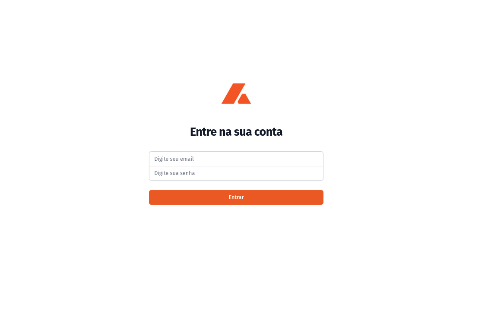

<h1 align="center">
    
</h1>

  <a href="#-tecnologias">Tecnologias</a>&nbsp;&nbsp;&nbsp;|&nbsp;&nbsp;&nbsp;
  <a href="#-projeto">Projeto</a>&nbsp;&nbsp;&nbsp;|&nbsp;&nbsp;&nbsp;
  <a href="#-api">Api</a>&nbsp;&nbsp;&nbsp;|&nbsp;&nbsp;&nbsp; 
  <a href="#-como-executar">Como executar</a>&nbsp;&nbsp;&nbsp;|&nbsp;&nbsp;&nbsp;  

 

  

## ✨ Tecnologias

Esse projeto foi desenvolvido com as seguintes tecnologias:

- [React](https://reactjs.org)
- [TypeScript](https://www.typescriptlang.org/)
- [TailwindCSS](https://tailwindcss.com/)
- [Axios](https://axios-http.com/ptbr/docs/intro)

## 💻 Projeto

Projeto desenvolvido para o processo seletivo da AtlasGR. O APP executa duas requisições para a API desenvolvida, onde:
- A primeira requisição irá enviar os dados deste usuário e receber um código randomico gerado pelo backend e armazenar este código em Cookie ou Sessão;
- A segunda requisição irá enviar o código armazenado em cookie/sessão para o backend e receber uma lista de amigos e exibir em cards;

## 🔖 API 

A API usada para este projeto foi desenvolvida especificamente para este uso (disponível neste perfil) e você pode executar localmente em sua máquina através [desse link](https://github.com/julio-souza3g/atlas-challenge-back).

## 🚀 Como executar

- Clone o repositório
- Instale as dependências com `npm install ou yarn`
- Inicie o servidor com `npm run start ou yarn start`

Agora você pode acessar [`localhost:3000`](http://localhost:3000) do seu navegador.

---

Feito com ♥ por [Júlio Souza](https://www.linkedin.com/in/j%C3%BAlio-souza-079351213/) 👋🏻 